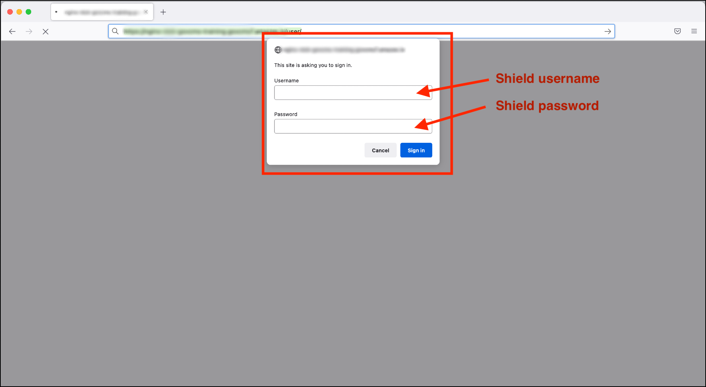
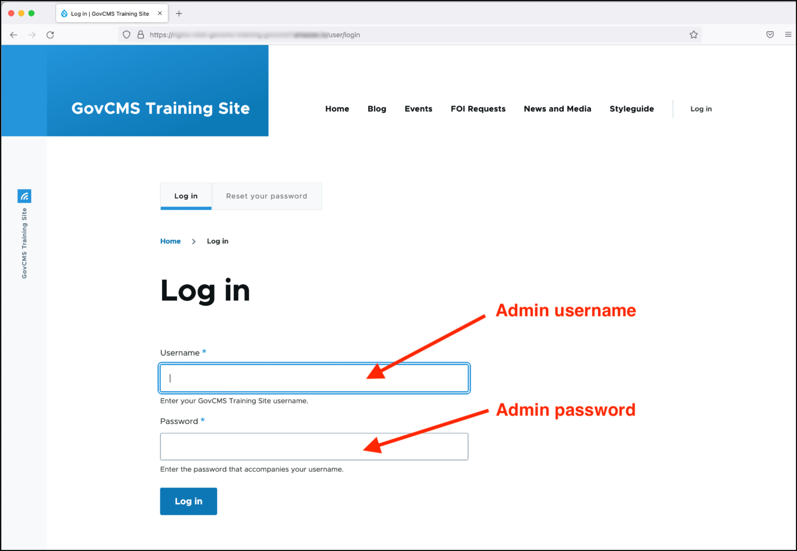

# Exercise 1.1 Log in to your training site as administrator

Navigate to your training environment URL \(provided in your training preparation emails) and type the **Shield** username and password into the Shield authentication popup:

**Username:** Refer to the email sent to you prior to the course

**Password:** Refer to the email sent to you prior to the course

You should now see the GovCMS login screen.

Enter your **Admin** username and password and sign in.

**Username:** Refer to the email sent to you prior to the course

**Password:** The password you saved after setting

After you’ve successfully logged in as an administrator, you’ll be redirected to a page that shows the following:

1. Your username as the page ‘title’
2. A message indicating how long your account has been active on the site
3. The **Admin menu**
4. The username of the account you’re currently logged in with

**Note:** Some elements from the screenshot below may be different, due to permissions settings.

## The Admin Menu

The band running across the top of the page \(3.\) is called the “Admin menu”, and is an indication that you’re currently logged into the site \(as opposed to simply visiting it as an “anonymous” user\). 

You might see or hear the Admin menu also referred to as **“Administration”**, **“Admin bar”**, **“Admin toolbar”**, **“Navbar”**, or simply **“Toolbar”**.

The Admin menu helps people who have logged into the site \(such as site admins, content authors/reviewers, etc.\) to navigate faster through the various pages of the admin interface. Once logged in, it’s available in the frontend and backend of your GovCMS site.

