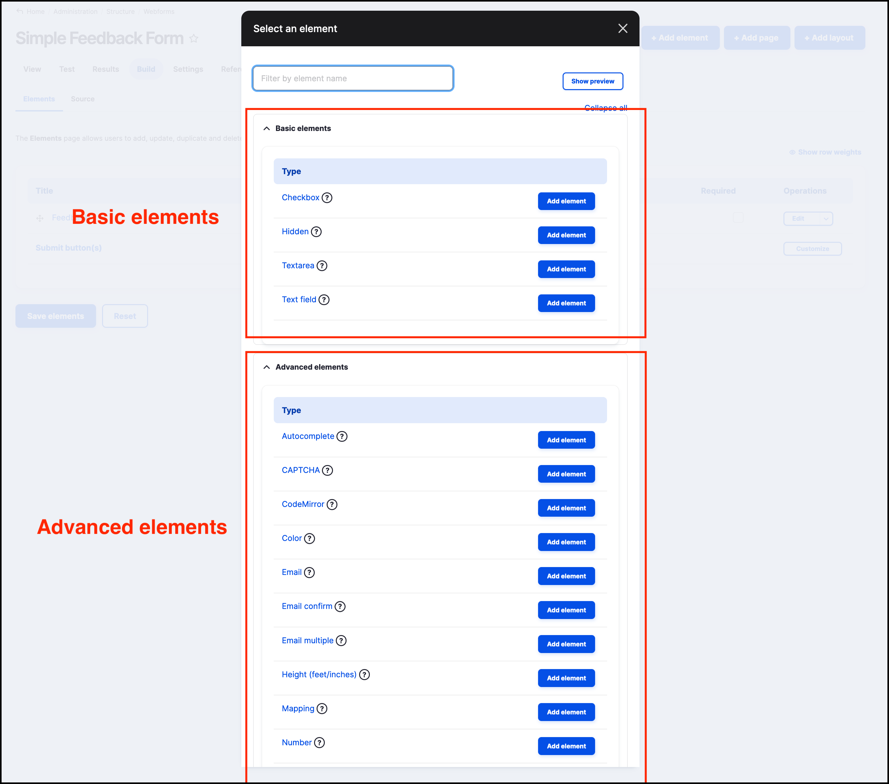
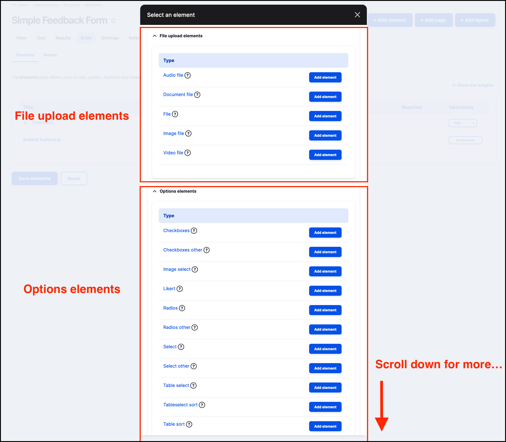
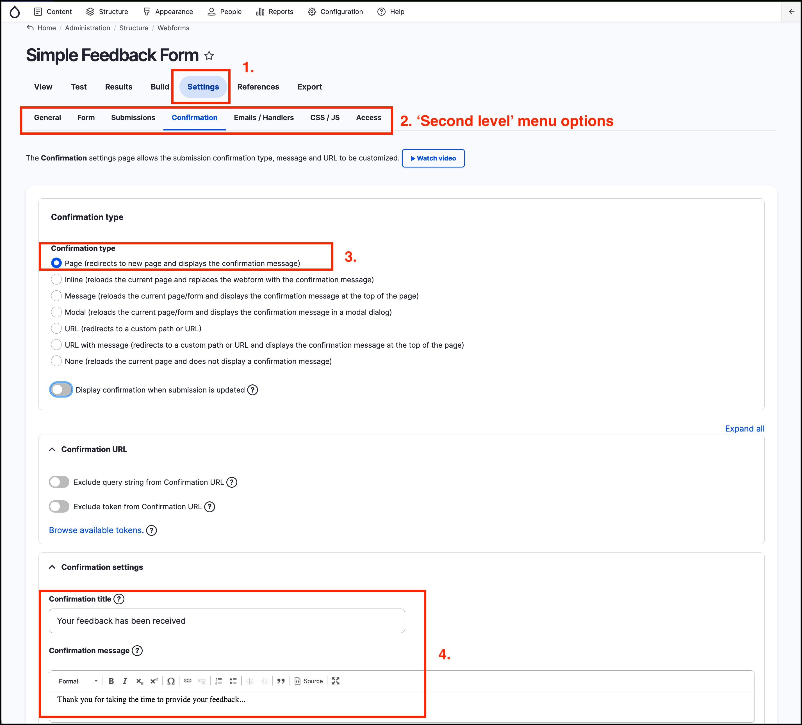

# Webform components

Webform components can be used to collect different types of data. Different elements can be added to a _Form_ using similar steps to the way a _Text field_ was added in [**Exercise 11.1**](https://salsa-digital.gitbook.io/govcms-content-administration/unit-11-capturing-data-with-forms/exercise-11-1-create-a-basic-webform).

To see all the elements available when creating or editing a form, click on _Structure_ on the _Admin menu_ then hover over _Webforms_ then click on _Forms_.

Click on the **Build** button to the right hand side of a selected form, as shown in the screenshot below.

Click on the **+Add element** button to the top right of the screen.

You will see a long list of available components. Scroll down to see them all. The screenshots below show some examples from _Basic elements_, _Advanced elements_, _File upload elements_ and _Options elements_.

## Webform options

The _Settings_ tab contains some useful advanced options.

1. To access these options, click on the _Settings_ menu.
2. Click on the various 'second level' menu items (_General, Form, Submissions, Confirmation, Emails/Handlers, CSS/JS, Access_) to view the options available.

In the sceenshot below, the form is configured to direct a site visitor to a Confirmation Page (3). The _Confirmation title_ and _Confirmation message_ (4) can be customised as shown in the screenshot.

Some of the more important and commonly used _options_ are outlined in the table below.

| **Option**           | **Description**                                                                                                                                                                                                                                                                                                                                                                                 |
| -------------------- | ----------------------------------------------------------------------------------------------------------------------------------------------------------------------------------------------------------------------------------------------------------------------------------------------------------------------------------------------------------------------------------------------- |
| Confirmation message | Displays a custom message to the user, such as “Thank you for filling out our feedback form. Someone will be in contact with you within the next 48 hours.”                                                                                                                                                                                                                                     |
| Redirection location | 
You may redirect users to another page using this advanced setting. For example, you could create a "Thank you" page that’s used for all your form submissions.

<strong>Tip</strong>: Be careful creating a "Thank you" page as it may appear on other pages, such as search results.
                                                                                              |
| Submission limits    | 
You can control how often a form can be submitted using the two "submission limit" fields.

<strong>Tip</strong>: Submission limits can be tricky. For example, if you’re collecting anonymous information the system has limited ways of knowing if a site visitor has already submitted the form and it’s also possible to trick the webform into accepting multiple submissions.
 |
| And many more...     | The GovCMS Webform provides great flexibility. Have a look through the other options to familiarise yourself with the form.                                                                                                                                                                                                                                                                     |

###
