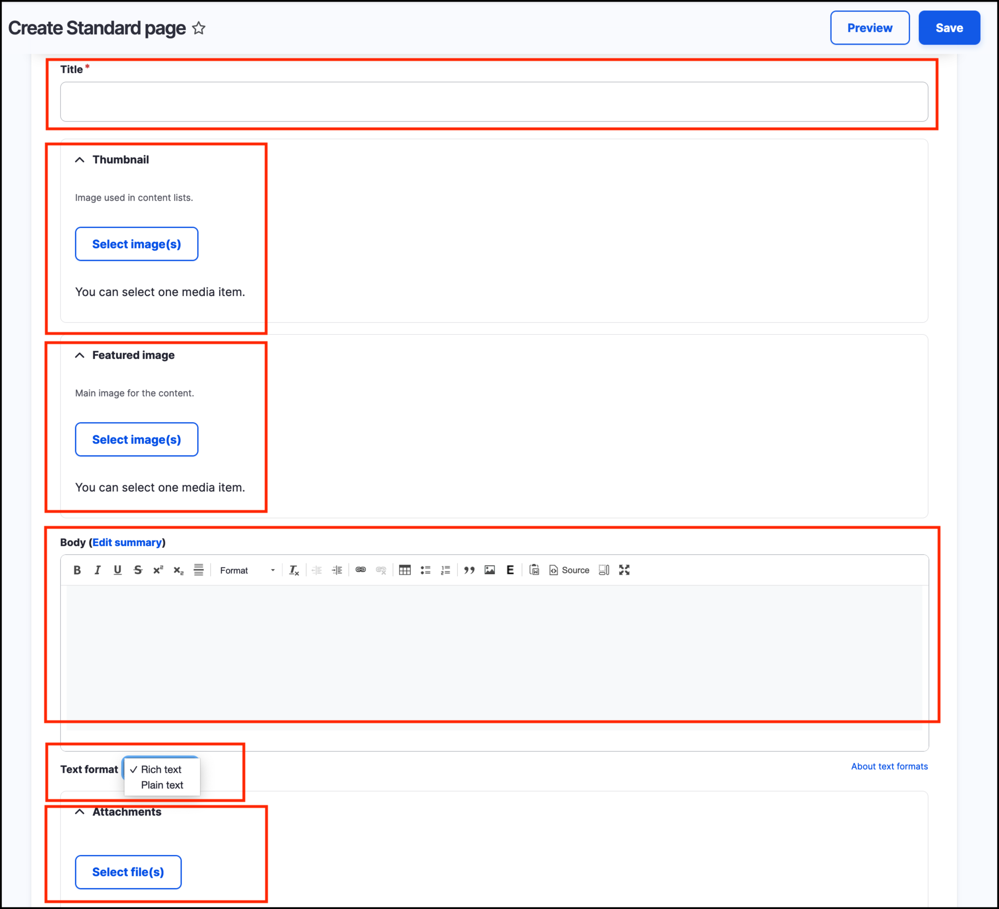

# Form fields and form widgets



## What is a form field
The data in your site’s content entities is stored in one or more fields that are attached to the entity type and/or subtype.

## What is a form widget

A widget defines the method used to enter the data for the field. For example, both _body text_ and _text area_ widgets may be configured to allow content authors to enter text into a form.

For more information relating to form fields and widgets, see the **[Drupal documentation](https://www.drupal.org/docs/user_guide/en/structure-widgets.html)**.

## Form fileds and widgets on the Create Standard Page form

As you begin creating content, you’ll discover various form fields and field widgets that are available. 

Let’s take the following example: **Create Standard Page** form. Navigate to this form by clicking on - _Content → Add Content → Standard Page_.

Note that each form field is represented by a different widget. Site builders or administrators may change the widget in use for a given field. For example, the Thumbnail Media Library widget may be changed to an image upload widget. Body text is using the Rich Text editor widget, but may be replaced with a text area.

Widgets are configured to make the job of Content Editor easier, to facilitate adding content and provide the best content editing experience.

By following the exercises in this manual, you will experience the majority of field widgets available in GovCMS.

_**Note** Field widgets are configured by a site builder - your development partner. Field widgets may be different between websites even though using the same GovCMS distribution._

