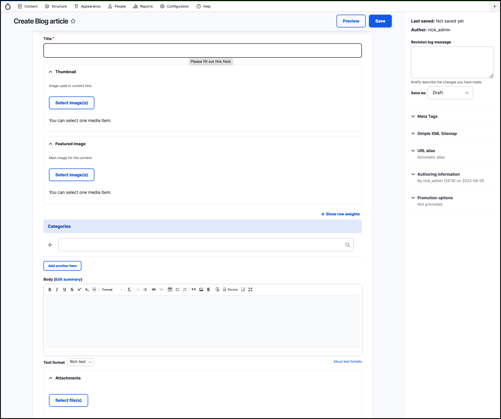
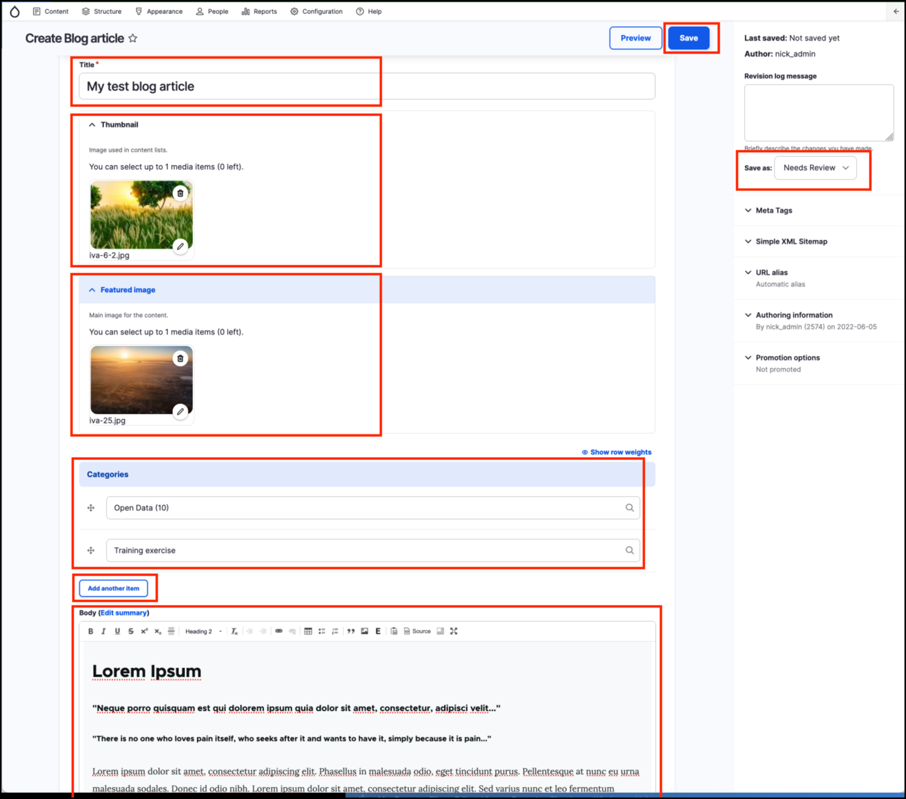
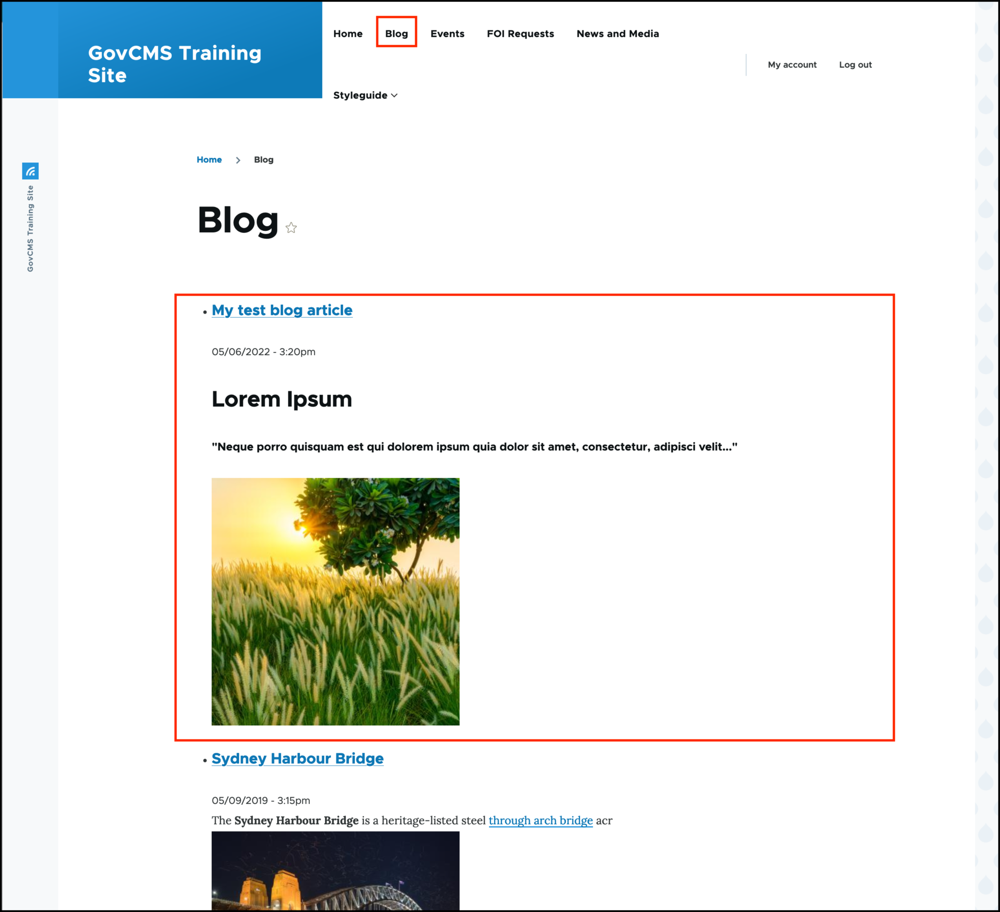

# Exercise 3.2: Create a Blog Article

## Optional Exercise 3.2: Create a Blog Article

In this exercise you will practice creating some content, editing fields, and using the markup toolbar. We will create a blog article and see how the automated listing of content will display it.

1. In the _Admin menu_, hover over _Content_
2. Click on **Add content**
3. Click on **Blog article**

    You should see a page similar to the screenshot below:
    
    
    
4. Add a title
5. In the _Categories_ field, select some taxonomy terms \(those allow us to categorise content and make searching for it easier - we will explore GovCMS’s taxonomy system later\). The field for Categories is called “autocomplete text”. As you begin typing any text in the field, GovCMS will try to match an existing category and display it below the field. Use your mouse to select the perfect match. New Categories can be created by entering a unique text.
6. Use the **Add another item** button to add multiple taxonomy terms. Try to enter something unique, not yet present in your site.
7. Select an image to use for the _Thumbnail_ and _Featured image_. Search through and select existing media.
8. In the _Body field_, add some formatted text, including bold text, italics, a link and a bullet-point list
9. Set the content to **Needs Review**.
10. Click **Save**

       The below screenshot highlights the areas to complete and the **Save** button.
       
    

    **Note** At this point if you navigate to the _Blogs_ menu item, your newly created Blog will not appear. This is because it was saved in the status **Needs Review**
    
11. Edit the page again and set the _Change to_ dropdown to "Published" and click the _Save_ button.
12. Navigate to the Blog page by clicking the _Blog_ menu item at the top of the page. You should see your new _Blog_ article in the list of items. As it is the most recently published item, it will appear first in the list.

