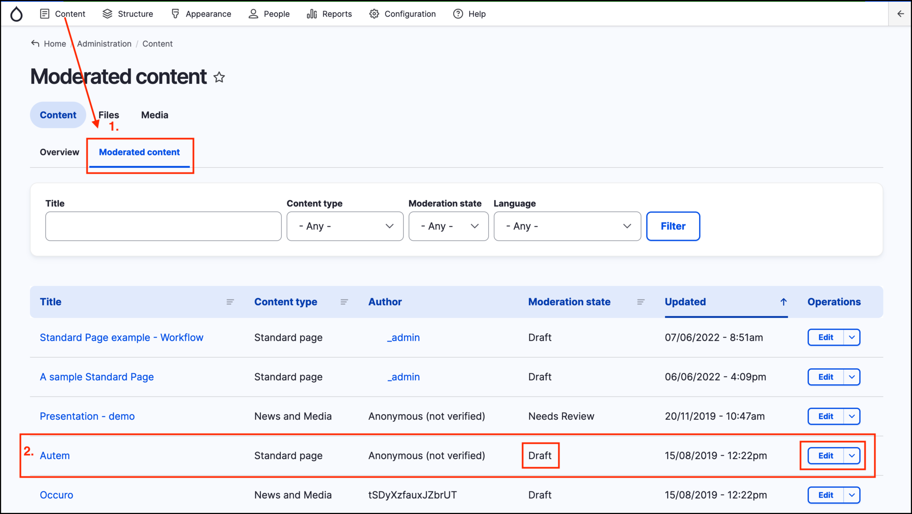
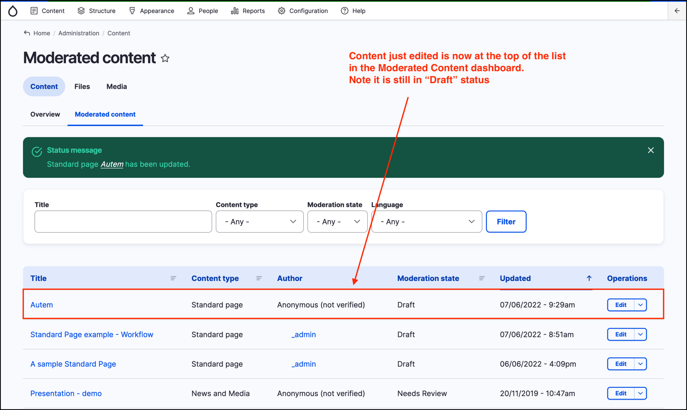

# Exercise 5.1: Use the Content Moderation workflow

This exercise will demonstrate how content can be moved through the _Content Moderation_ statuses.

1. In the _Admin menu_, click on **Content**, then click on the secondary tab **Moderated Content**.
2. Choose a _content_ item in the list that requires moderation. 
3. Click on the **Edit** button at the right hand side of the page.

    For example you could choose to edit the _Standard page_ called **Autem** which is in the state of **Draft** as highlighted in the screenshot below:
    
    

4. Make some changes to the content \(e.g. delete some text or add text\).
5. Save the content, leaving it in the "Draft" status \(notice that you’re redirected to the _Moderated Content_ page and that the content page you were just editing is now at the top of the list\).

	See the screenshot below:
	
    	
6. Select the content item you just edited and click **Edit** again.
7. Select “Needs Review" from the _Change to:_ dropdown and click **Save**.
8. Edit the same content item again.
9. Select “Published" from the _Change to:_ dropdown and click **Save**.

**Note** Moving content through the workflow process from Draft to Published usually involves multiple people. However, if your account has full permissions, you can move content through the states and publish changes immediately.
