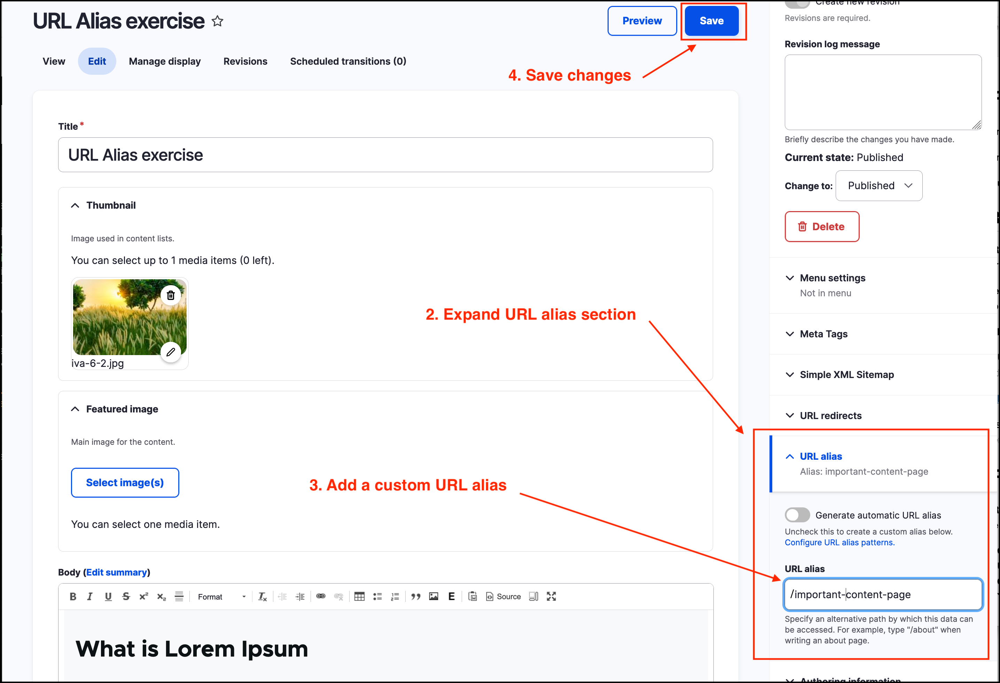

# Exercise 7.2: Create a URL Alias

In this exercise you’ll learn how to **create** a URL alias for a page.

1. Return to edit the page created in **[Exercise 7.1](Exercise-7-1-update-page-url-alias.md)**. \(From the _Admin menu_ click on **Content**, then click on your page from the list and click the **Edit** menu item\).
2. Expand the URL alias section.
3. Set a custom URL alias, such as _**/important-content-page**_ \(you may choose your own\). **Note** The URL must begin with a backslash: '/'
4. Click on the **Save** button at the top right of the page.

    

5. Note the new URL for the page.
6. Try navigating to the **/node/100** path noted down in the previous exercise, by pasting it into the address bar of your browser. \(The node ID number - 100 - will differ for you\).
7. Next, return to Edit the page from step 1.
8. Under the **URL Alias** section on the right-hand side, check the _Generate automatic URL alias box_.
9. **Save** the page - compare the results.
10. Check if the internal path \(such as node/100\) still works.
11. Check if the manually entered URL alias from step 2 is still functional.
12. Ask your trainer any questions.
