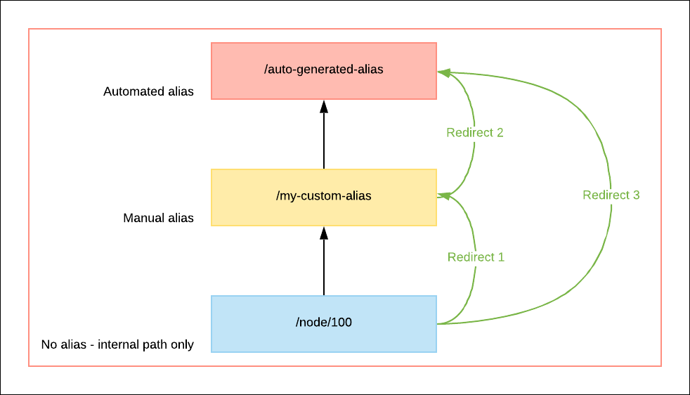

# URL aliases and redirects





This unit discusses URL aliases and redirects and how they relate to URLs.

## URLs

A URL \(Uniform Resource Locator\) is a web address. While some can be long and meaningless, others can be simple and descriptive. 

For example, the URL below does not provide a good description of the content it will provide to a site visitor:

- https://mywebsite/online.store/products/category13/stock/93891/show.html

This URL, on the other hand, provides clear information about the source or organisation \(GovCMS\) as well as the topic of the content \(support\): 

- [https://www.govcms.gov.au/support](https://www.govcms.gov.au/support)

URLs can be automatically generated based on the **Page title** of a piece of _Content_, automatically generated numerically, or specified using a URL alias.

Drupal \(and GovCMS\) creates and maintains its own _internal_ URL for each piece of _Content_. These URLs contain the **node/** path and a number, for example https://mywebsite.gov.au/**node/15**. This address is only accessible to content authors and administrators that are logged in to the site.

It also \(by default\) creates a URL based on the _Title_ of content. For a _Standard Page_ with a _Title_ of 'My Example Standard Page' would have both the following URLS:

- **https://mysite.gov.au/node/15** \(accessible only to logged in users\), and;
- **https://mysite.gov.au/my-example-standard-page** - accessible to site visitors \(and search engines\)

URL aliases are used to create more user-friendly URLs as discussed below. 

# URL aliases

A URL alias is a manually created, specific, descriptive URL for a page on a website. There are three main benefits of using a URL alias:

1. Create more descriptive and meaningful URL for users.
2. URL aliases are read by search engines, and form an important component of Search Engine Optimisation \(SEO\).
3. They make websites, its links and results in search engines look more professional.

URL aliases are generally the best type of URL for content authors to provide for site visitors to use. 

# URL redirects



Sometimes an _alternative_ URL is required for a web address or piece of _Content_. This may be due to an incorrect URL being published in print, or when providing a link from another website, where a shorter URL is preferable \(for example, for a marketing campaign\).

Redirects are also created automatically by GovCMS to make sure only one \(usually the latest\) URL alias is functional and to ensure previously created URL aliases do not return “404 Not Found” response.

The screenshot below illustrates how _Redirects_ forward all traffic to the latest Alias for a given URL.

 

