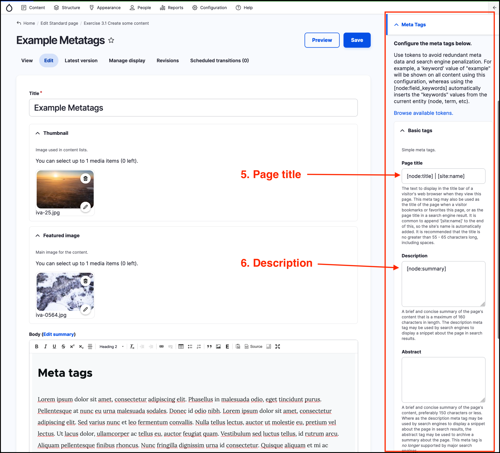

# Meta tags and SEO



The GovCMS distribution provides a helpful set of tools to manage the appearance of your content in major search engines such as Google, Bing, Yahoo and others. This functionality is provided by the Metatag module \([https://www.drupal.org/project/metatag](https://www.drupal.org/project/metatag)\).

The Metatag module provides two areas to manage the metadata of your site:

1. Global Metatag administration area: This area is usually only accessible by Administrator users.
2. Content pages: The metadata for can be managed at the page level for all _content_ or pages. 

To understand how to manage content metadata, perform a simple search for “Drupal metatag” in Google. The first search result is [https://www.drupal.org/project/metatag](https://www.drupal.org/project/metatag). 

The search result snippet consists of the following elements:  

1. URL to the page
2. Page title
3. Site name
4. Search excerpt

  
As a Content Approver, you can manage all of these elements using the _Meta Tags_ pane in every content page.

When creating or editing content - the _Meta Tags_ pane is available on the right-hand side of the page in an expandable section.

By default the main elements 1-4 will be pre-populated by GovCMS automatically when you create or update content. These elements are populated using **tokens**. \(Tokens are covered in the next lesson\).

In the screenshot above, the _Page title_ field \(5\) populates elements 1 and 2 from the Google search result screenshot. The Description field \(6\) populates the search result excerpt \(4\). The URL alias of the page \(covered in **[Unit 7](../unit-7-managing-url-aliases-and-redirects/url-aliases-and-redirects.md)**\) is used as element 3 in the Google search result screenshot.

Search results display can be customised by manually updating the information in the Meta Tags area.
